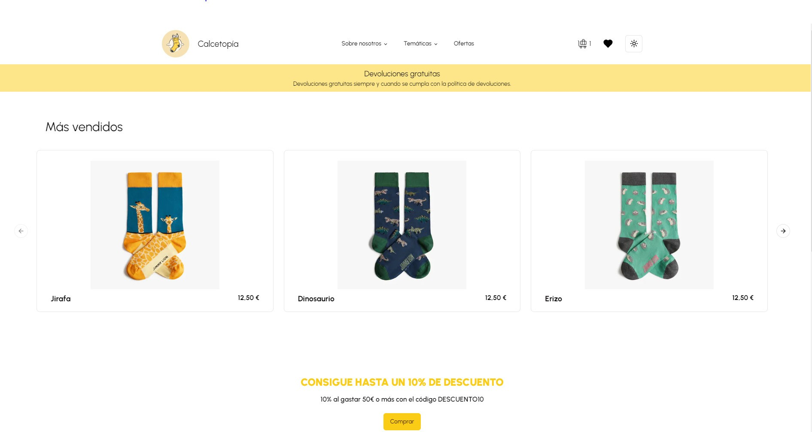

# Calcetopía
Este proyecto recrea una tienda online en la que poder encontrar algunos de los calcetines más divertidos y coloridos del mercado. La idea de este proyecto surge a raíz de la necesidad de unir dos de mis grandes pasiones: la programación y los calcetines.

## Tabla de contenidos
+ Demostración
+ Características
+ Instalación
+ Proceso de creación y tecnologías
+ Licencia
+ Autor

## Demostración

Como más vale un enlace que mil palabras, podéis encontrarlo aquí:
https://calcetopia.vercel.app/


## Características
Las características principales con las que cuenta Calcetopía son las siguientes:
+ Filtro de los calcetines más vendidos.
+ Filtro de las diferentes categorías de calcetines.
+ Sección de ofertas en la que poder ver tanto el precio original como el precio con el descuento.
+ Sección de favoritos en la que poder guardar tus favoritos simplemente haciendo clic sobre el icono que aparece al pasar por cada producto. La página permite eliminar los favoritos o acceder directamente al detalle de cada producto guardado.
+ Página de detalle en la que encontrarás más información de cada producto, así como un apartado para seleccionar la talla (si es que hay stock).
+ En la misma página de detalle, también cuenta con un apartado de productos similares, en caso de que necesites una ayuda extra para elegir tus productos favoritos.
+ El carrito de compra que gracias a un icono que se encuentra en la parte superior de las pantallas, podremos ver en todo momento cuántos productos tenemos en el carrito. Además, en la página de detalle del carrito, podremos añadir varias unidades del mismo producto, ver la talla que hemos elegido, así como un pequeño resumen de compra y un apartado para añadir un código de descuento.
+ Pasarela de pago que funciona con datos ficticios gracias a la integración con Stripe.

## Instalación
+  Clona el repositorio
+ Abre el proyecto con tu editor favorito, como VS Code.
+ Instala todas las dependencias necesias mediante ```npm i``` 
+ Abre el proyecto en el navegador mediante ```npm run dev``` 
## Proceso de creación y tecnologías
Las tecnologías utilizadas para este proyecto son las siguientes:
- Next.js. Gracias a Next.js he podido crear una navegación sencilla entre las diferentes pantallas de la web, además de una integración con el back-end fácil y sencilla.
- TypeScript. Gracias a Typescript he podido crear un código más seguro y robusto, evitando errores menores a lo largo de todo el proceso de creación.
- MySQL. Gracias a MySQL he podido almacenar toda la información de cada producto disponible en un solo lugar.
- Shadcn me ha permitido implementar componentes de forma sencilla para darle un aspecto más cohesionado a toda la web.
- Stripe me ha permitido implementar la pasarela de pago.
## Licencia
Este proyecto está bajo la licencia MIT.
## Autor
Hecho con ❤️ y 🧦 por mí, Teresa Toledo.